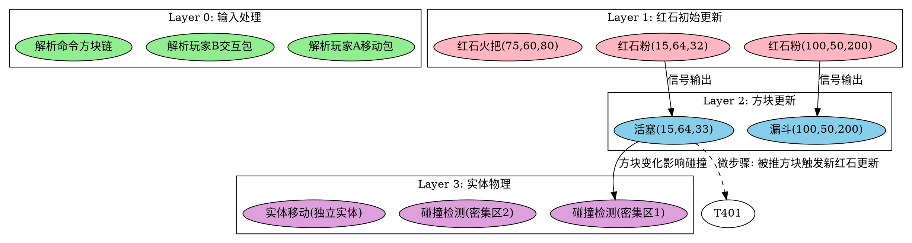

星云架构 v4.0：确定性多核Minecraft服务端完整工程设计

—— 一份让工程师落泪的施工蓝图

版本：4.1 工程落地版（修订 DG1 Criterion 3 定义，新增 Phase 1.5，新增 B9 D5 实验记录）
状态：Phase 0（红石 DG1 已完成；实体 MOVE / 方块实体 / 流体 / 爆炸各有一个 live guard 切片；B9 D5 Paper 单线程 oracle 验证完成；光照/AI/碰撞/伤害/Random 完整模型待实现）
日期：2026年7月
文档规模：完整工程规格

序言：为什么这份白皮书存在

Minecraft服务端开发的历史，是一部在三条轴线上反复挣扎的历史：

· 性能轴：从单线程到Folia的多线程，每一次突破都伴随着兼容性的牺牲。
· 确定性轴：生电玩家需要每一tick的行为与原版严格一致，这是他们所有机器的基石。
· 兼容性轴：十余年积累的插件生态、模组生态，不可能推倒重来。

社区普遍认为这三者构成“不可能三角”——你只能选两个。Folia选择了性能和兼容性（部分），牺牲了确定性。原版服务端选择了确定性和兼容性，牺牲了性能。

星云架构的目标是：在物理极限允许的范围内，打破这个三角。

这不是狂妄。计算机科学的历史反复证明：当一个系统的信息依赖结构被充分理解后，并行化可以在不牺牲确定性的前提下实现——超标量处理器如此、并行编译器如此、分布式数据库如此。Minecraft服务端不特殊，它只是一个尚未被充分理解其依赖结构的游戏服务器。

这份白皮书试图完成这个“充分理解”——它将Minecraft服务端的形式化定义、信息依赖关系、并行执行策略、工程实施路径全部展开，直到一名合格的系统工程师可以在没有任何外部解释的情况下，开始编写第一行代码。

卷一：数学基础与形式化模型

第一章：Minecraft服务端的形式化定义

1.1 系统状态

Minecraft服务端在任意时刻的状态 S 是一个五元组：

S = (W, E, T, R, G)

其中：

· W（世界状态）：一个有限映射 P \rightarrow B，将坐标 p \in \mathbb{Z}^3 映射到方块状态 b \in \mathcal{B}，其中 \mathcal{B} 是所有可能方块状态的集合。对于每个维度，存在独立的 W_d。
· E（实体状态）：一个有限映射 I \rightarrow \mathcal{E}，将实体ID映射到实体数据。每个实体 e \in \mathcal{E} 包含：位置 (x,y,z)、速度 (v_x, v_y, v_z)、NBT数据树、AI状态机当前节点、以及指向其所在维度的引用。
· T（方块实体状态）：一个有限映射 P_T \rightarrow \mathcal{T}，将方块实体坐标映射到方块实体数据。每个方块实体 t \in \mathcal{T} 包含：NBT数据树（物品栏、进度等）、内部tick计数器。
· R（随机状态）：一个多元组 (R_w, R_{e_1}, R_{e_2}, ..., R_{e_n})，其中 R_w 是维度共享随机数生成器的内部状态（一个64位种子+计数器），R_{e_i} 是每个实体的独立随机数生成器状态。
· G（全局状态）：包含：当前游戏时间（game time）、当前天数（day time）、天气状态（晴/雨/雷暴及持续时间和过渡状态）、世界边界（中心坐标和半径）、难度、游戏规则映射表、服务器玩家列表及其连接状态。

1.2 Tick函数

服务端的核心执行是一个确定性函数 F，将状态 S_t 和输入 I_t 映射到新状态 S_{t+1}：

S_{t+1} = F(S_t, I_t)

其中 I_t 是在第 t tick开始时收集的所有玩家输入（移动包、交互包、聊天包）。I_t 在tick开始后不可变。

确定性公理：F 是纯函数。给定相同的 (S_t, I_t)，F 产生相同的 S_{t+1}。这个公理是原版Minecraft服务端的基石，也是星云T0模式的最高准则。

1.3 Tick的分解

F 可以按子系统分解为多个子函数的组合：

F = F_{\text{network}} \circ F_{\text{entities}} \circ F_{\text{blockEntities}} \circ F_{\text{blocks}} \circ F_{\text{fluids}} \circ F_{\text{redstone}} \circ ...

在原版单线程实现中，这些子函数按固定顺序依次执行。但这一顺序并非全部是因果必然——有些顺序是历史实现的偶然。星云的核心工作就是区分因果必然的顺序与历史偶然的顺序，仅保留前者，并行化后者。

因果必然的顺序：A必须在B之前执行，因为B的输入依赖于A的输出。例如：红石信号必须在活塞推动之前计算，因为活塞的激活状态依赖于红石信号。

历史偶然的顺序：A和B操作互不相交的数据，但原版代码中A被放在了B前面。例如：两个远隔千里的生物的AI更新顺序。

1.4 形式化注释

下文使用的符号：

符号 含义
R(T) 任务 T 的读集
W(T) 任务 T 的写集
T_i \prec T_j T_i 必须在 T_j 之前执行
T_i \parallel T_j T_i 和 T_j 可以并行执行
\mathcal{G}_t 第 t tick的任务DAG
\text{Layers}(\mathcal{G}) \mathcal{G} 的拓扑分层

第二章：数据流模型的形式化

2.1 任务与读写集

定义1（任务）：一个任务 T 是tick执行中的最小可调度单元。每个任务 T 关联：

· 一个唯一标识符 \text{id}(T)
· 一个执行函数 \text{exec}(T): S \rightarrow S_{\text{local}}，计算任务的结果（对状态的局部修改）
· 一个读集 R(T)：执行 \text{exec}(T) 需要读取的状态子集
· 一个写集 W(T)：执行 \text{exec}(T) 将修改的状态子集

读写集的具体粒度见第三章。

定义2（依赖关系）：对于两个任务 T_i 和 T_j：

· 写-读依赖（RAW）：若 W(T_i) \cap R(T_j) \neq \emptyset，则 T_i \prec T_j
· 写-写依赖（WAW）：若 W(T_i) \cap W(T_j) \neq \emptyset，则必须确定一个顺序。星云使用确定性仲裁规则：按 (\text{hash}(\text{id}(T_i)), \text{hash}(\text{id}(T_j))) 的字典序决定谁先执行。此规则对所有tick保持一致。
· 读-写依赖（WAR）：若 R(T_i) \cap W(T_j) \neq \emptyset，则 T_i \prec T_j（保证 T_j 不会在 T_i 读取后修改数据）

定义3（并行条件）：T_i \parallel T_j 当且仅当 T_i \not\prec T_j 且 T_j \not\prec T_i。即两者之间不存在任何有向依赖路径。

2.2 DAG构建算法

输入：当前状态 S_t、输入 I_t、所有标记为“脏”的元素集合 D_t
输出：任务DAG \mathcal{G}_t = (V_t, E_t)

```
Algorithm: BuildDAG(S_t, I_t, D_t)

1. V_t ← ∅, E_t ← ∅
2. For each dirty element d ∈ D_t:
   a. 确定处理d所需的任务类型 τ(d)
   b. 创建任务节点 T_d，关联类型 τ
   c. 从标注库查询 τ 的读写集模板 RW_τ
   d. 实例化模板：用d的具体参数（坐标、ID等）填充模板中的占位符
   e. 将 T_d 加入 V_t
3. For each T_i, T_j ∈ V_t (i ≠ j):
   a. If W(T_i) ∩ R(T_j) ≠ ∅: E_t ← E_t ∪ {(T_i, T_j)}
   b. If W(T_i) ∩ W(T_j) ≠ ∅: 按确定性仲裁规则添加边
   c. If R(T_i) ∩ W(T_j) ≠ ∅: E_t ← E_t ∪ {(T_i, T_j)}  // WAR
4. 检测 E_t 中的环：
   a. 使用Tarjan算法识别强连通分量(SCC)
   b. 对每个SCC C:
      - 若 |C| ≤ 阈值（默认128节点）且内部为物理约束循环（如碰撞、红石环）：
        创建复合任务 T_C，将C收缩为单节点
      - 否则：标记为异常，记录日志，将C中的所有任务串行化（按ID排序）
5. 对 V_t 进行分层拓扑排序，生成 Layers(G_t)
6. Return G_t = (V_t, E_t, Layers)
```

复杂度：

· 步骤2：O(|D_t|)，常数为模板实例化开销（~100ns/任务）
· 步骤3：使用空间哈希索引后为 O(|D_t| \times K)，其中 K 是单个空间桶内的平均任务数（通常<50）
· 步骤4：O(|V_t| + |E_t|)，Tarjan算法线性时间
· 步骤5：O(|V_t| + |E_t|)

构建开销估计：对于 |D_t| = 100000、K=30、|E_t| \approx 3|V_t|（每个任务平均3条边）的典型负载：

· 步骤2：~10ms（100ns/任务 × 100000）
· 步骤3（索引后）：~15ms（500次比较/桶 × 2000桶 × 15ns/比较）
· 步骤4+5：~5ms
· 总计：~30ms

这超出了50ms tick预算的50%以上，仅仅用于构建DAG。因此必须引入空间哈希预分桶将问题局部化——每个桶独立构建，构建本身并行化。分桶后，每个桶约500个任务，桶内构建时间降至~50μs，所有桶并行构建，全局收集约需100μs。总DAG构建时间目标<500μs（占tick预算的1%）。

2.2 RW-Set Integrity Guard 架构（确定性定理的实现保障）

**定理 1（DAG 执行的确定性）的实现依赖。** §1.2 的确定性定理证明：若任务读写集声明完整，则 DAG 的任意合法拓扑排序与单线程原版执行一致。反之：若声明不完整（遗漏了真实访问），DAG 会丢失依赖边，两个本应串行的任务并行执行，导致状态非确定性损坏。

因此，**读写集完整性是确定性的充要条件**。§12.4 的 Integrity Checker 是验证机制，但机制本身需要一个工程架构来落地。

**每子系统 Tracer 架构。** 各子系统的任务执行器（TaskRunner）通过一个 `RwGuardTracer` 基接口将每次任务执行的实际访问记录到一个 `ThreadLocalAccessTrace`：

```
 RwGuardTracer（接口）
 ├── RedstoneRwGuardTracer  — 拦截 RedstoneTaskContext 的 block read/write 调用
 ├── EntityRwGuardTracer   — 拦截 EntityTaskContext 的 entity-field read/write 调用
 ├── BlockEntityRwGuardTracer — 拦截 BlockEntityTaskContext 的 BE-field read/write 调用
 ├── FluidRwGuardTracer    — 拦截 FluidContext 的 block read/write 调用
 └── ExplosionRwGuardTracer — 拦截 ExplosionContext 的 block/entity-field/random 调用
```

每个子系统有一个 `*TaskGuardHook`：在任务执行前 `reset()` ThreadLocalTrace，在执行后调用 `RWSetConsistencyChecker.check(task.declaredRWSet(), threadLocalTrace.snapshot())`。若发现访问不在声明集中，输出可操作的违规报告（坐标/字段、违规类型、建议修复）。

**Guard 的三种模式（通过 `-Dnebula.rw.guard.mode={WARN|ENFORCE|LOG}` 配置）：**

| 模式 | 行为 |
|---|---|
| WARN | 写 JSONL 违规报告到 `plugins/Nebula/rw-violations.jsonl`，并在日志中输出一行摘要；任务继续执行 |
| ENFORCE | 检测到第一个违规时抛出 `RWSetViolationException`，中止 tick；用于 CI 测试 |
| LOG | 仅计数，不输出报告；用于生产环境采样 |

`-Dnebula.rw.guard.sample=N`（默认 1.0）对所有任务启用全采样；设为 0.01 则对 1% 的任务启用采样，以降低生产环境的 Guard 开销。

**Guard 的 live 验证成果（Phase 0，B8 工作）：**

- **红石**：干净 run（lever→8-wire→lamp，940 tracedTasks，0 violations）和故意破坏 run（删除 +X 邻居读，5147 violations）均已在 Folia 上验证，证明 Guard 有真实的检测能力。
- **实体 MOVE**：fast-falling cow 首次 run 产生 9 个 terrain violation；RW-set 修复后重新 run（163 tracedTasks，0 violations）干净。
- **方块实体**：hopper（48 tracedTasks，0 violations）和 furnace 的 live field 访问已验证。
- **流体**：water flow（1 tracedTask，0 violations）和故意删除 west 邻居读（352 violations）已验证。
- **爆炸**：TNT smoke（2 tracedTasks，0 violations）已验证。

这五条 live run 的意义：它们是**确定性定理首次在真实 Folia 上被验证**，而不只是单元测试中的理论断言。

2.3 微步骤扩展

对于在同一tick内需要多次传播的子系统（红石、流体），DAG支持微步骤扩展：

```
Algorithm: ExtendDAG_ForMicroStep(G_t, trigger_tasks)

1. new_tasks ← trigger_tasks 生成的下游任务
2. For each T ∈ new_tasks:
   a. 实例化读写集
   b. 检查与 G_t 中现有任务的冲突：
      - 若有冲突且冲突任务未执行：建立依赖边
      - 若有冲突且冲突任务已执行：T被标记为"冲突-延迟"，移入下一tick的初始脏集合
      - 若无冲突：T加入当前微步骤层
3. 若 new_tasks 非空且微步骤计数 < MAX_MICRO_STEPS（默认256）：
   递归调用 ExtendDAG_ForMicroStep(G_t, new_tasks)
4. Return 扩展后的 G_t
```

MAX_MICRO_STEPS=256的物理依据：红石信号每经过一个中继器至少消耗1tick（除少数0tick情况），因此单tick内需要微步骤传播的元件数量受电路规模和中继器延迟的严格物理约束。256是任何实际电路在单tick内可能触发的最大翻转次数的安全上界。超过此值意味着要么是恶意构造的电路，要么是bug，此时强制终止微步骤并记录警告。

2.4 确定性定理

定理1（DAG执行的确定性）：若任务读写集声明完整（即每个任务实际访问的状态完全包含在其声明的读写集中），则DAG的任意合法拓扑排序的执行结果与单线程按原版顺序的执行结果一致。

证明概要：

1. 原版单线程执行定义了一个全序 \prec_{\text{vanilla}}。
2. DAG的依赖边捕获了所有实际的数据依赖（RAW、WAW、WAR）。
3. 对于任意两个任务，若原版中 T_i 在 T_j 之前执行，且两者无数据依赖（操作不相交的数据集），则它们的结果不依赖于执行顺序——这是数据无关性的定义。
4. 因此，DAG的任意合法拓扑排序保持所有数据依赖，仅在无关任务之间重新排序，而无关任务的排序不影响最终状态。
5. 推论：若存在数据依赖但DAG未捕获（遗漏了边），则结果可能与原版不同。因此，读写集的完整性是确定性的充要条件。∎

这个定理说明了为什么v3.2的验证机制（见卷四）是正确性保证的核心——它负责检测读写集声明是否完整。

第三章：读写集（RW-Set）规格

3.1 读写集的数据模型

每个任务的读写集使用以下分层数据模型：

```
RWSet {
    blocks: Set<WorldPos>           // 坐标级方块读写
    blockEntities: Set<WorldPos>    // 方块实体读写
    entities: Set<EntityField>      // 实体字段级读写
    poi: Set<PoiQuery>              // POI查询
    global: Set<GlobalKey>          // 全局状态读写
    random: RandomUsage             // Random使用声明
    events: Set<EventType>          // 可能触发的事件类型
}
```

其中：

```
WorldPos = (dimension_id: int, x: int, y: int, z: int)

EntityField = (entity_id: long, field_path: FieldPath)
FieldPath = "position" | "velocity" | "health" | "nbt" | "ai_state" | ...

PoiQuery = (dimension_id: int, center: WorldPos, radius: int, poi_type: PoiType)

GlobalKey = "game_time" | "day_time" | "weather" | "world_border" | ...

RandomUsage {
    instance: RandomInstance  // ENTITY_RANDOM | WORLD_RANDOM | ...
    max_calls_estimate: int   // 该任务预期调用Random的次数上界
}
```

3.2 粒度选择规则

读写集粒度的选择遵循以下规则：

规则1（方块）：总是以单个坐标为粒度。两个不同坐标的方块操作自动独立。

规则2（实体字段）：按字段路径分组：

· position（坐标+速度）：物理和移动使用
· health：伤害和恢复使用
· nbt：整个NBT树作为一个读写单元（理由：NBT修改极少，粗粒度无实际并行度损失）
· ai_state（Brain.memory）：AI决策使用
· inventory：物品操作使用

规则3（方块实体）：按槽位索引分组。例如漏斗的每个槽位独立。

规则4（全局状态）：每个GlobalKey作为一个读写单元。

规则5（事件触发）：事件触发作为写集的一部分声明。若任务声明events: [BlockUpdate]，则该任务可能触发方块更新事件。

3.3 读集与写集的实例化示例

示例1：红石粉更新

```
任务：updateRedstoneWire(pos=(15, 64, 32), dim=OVERWORLD)

读集：
  blocks: [(OVERWORLD, 15, 64, 31), (OVERWORLD, 15, 64, 33),  // 南北
           (OVERWORLD, 14, 64, 32), (OVERWORLD, 16, 64, 32),  // 西东
           (OVERWORLD, 15, 63, 32), (OVERWORLD, 15, 65, 32)]  // 下上
写集：
  blocks: [(OVERWORLD, 15, 64, 32)]
  events: [BLOCK_UPDATE]  // 若信号变化，触发相邻方块更新
RandomUsage: NONE
```

示例2：僵尸AI tick

```
任务：tickZombieAI(entity_id=12345, dim=OVERWORLD)

读集：
  entities: [
    (12345, "position"),
    (12345, "health"),
    (12345, "ai_state"),
    (所有在感知范围内的实体的 ("position", "health", "entity_type"))
  ]
  poi: [(OVERWORLD, pos(12345), radius=64, type=PLAYER)]
写集：
  entities: [
    (12345, "position"),     // 可能移动
    (12345, "ai_state"),     // AI状态更新
    (12345, "health")        // 可能受伤
  ]
  events: [ENTITY_MOVED]
RandomUsage: (ENTITY_RANDOM, max_calls_estimate=5)
```

示例3：漏斗tick

```
任务：tickHopper(pos=(100, 50, 200), dim=OVERWORLD)

读集：
  blockEntities: [(OVERWORLD, 100, 51, 200)]  // 上方容器
  blocks: [(OVERWORLD, 100, 50, 200)]          // 自身
写集：
  blockEntities: [
    (OVERWORLD, 100, 50, 200, "inventory.slots[0..4]"),  // 自身物品栏
    (OVERWORLD, 100, 51, 200, "inventory.slots[*]")      // 目标容器
  ]
RandomUsage: NONE
```

3.4 读写集的合并与冲突检测

合并规则：当两个任务需要合并其读写集时（如创建复合任务），合并后的读写集为各自的并集：

· R(T_1 \oplus T_2) = R(T_1) \cup R(T_2)
· W(T_1 \oplus T_2) = W(T_1) \cup W(T_2)

冲突检测：两个任务的读/写集冲突检测通过集合交集运算实现。对于结构化字段（如EntityField），交集检测支持字段路径前缀匹配——例如 (12345, "nbt") 与 (12345, "nbt.display.Name") 判定为冲突（因为前者是后者的前缀，写入前者可能覆盖后者）。

空间索引加速：冲突检测通过空间哈希索引加速（见第四章），不进行全对全比较。

卷二：核心子系统设计

第四章：DAG构建引擎

4.1 空间哈希预分桶

桶定义：将每个维度划分为 32 \times 32 \times 32 区块的构建桶（Build Bucket）。桶的坐标系独立于Minecraft的区块坐标系：

\text{BucketID}(p) = (\lfloor x/32 \rfloor, \lfloor y/32 \rfloor, \lfloor z/32 \rfloor, \text{dim})

32区块的选择依据：

· 红石信号无中继器传播上限：15格 < 1区块
· 中继器链：单个中继器延迟1-4tick，单tick内最多通过1个中继器。多级中继器链在单tick内传播距离受限于链的长度（≤16个中继器 = 16格）。32区块提供充足余量。
· 实体单tick最大移动距离：< 16区块（即使爆炸加速也在此范围内）
· 碰撞检测半径：< 4区块
· 命令方块跨区操作：作为全局任务处理（见4.5节），不受桶限制

桶间依赖：位于桶边界的任务可能跨越桶边界。处理方式：

1. 构建时，每个任务根据其读写集覆盖的空间范围被分配到所有涉及的桶。
2. 边界任务（读写集触及桶边界的任务）被复制到所有相邻桶的构建中。
3. 合并阶段，去除跨桶的重复边。

边界任务的占比：在最坏均匀分布下，32³区块桶的边界任务比例约为 1 - (30/32)^3 \approx 18\%。但其中只有与其他桶元素实际交互的部分才产生跨桶依赖，实际跨桶依赖边<1%总边数。

4.2 桶内DAG构建

每个桶独立执行以下构建流程：

```
Algorithm: BuildBucketDAG(bucket_tasks)

1. 初始化空间网格：将桶内32³区块空间划分为1×1×1区块的网格单元（共32768个单元）
2. 为每个任务分配网格单元：
   For each task T ∈ bucket_tasks:
     For each grid_cell C 与 T的读写集空间范围相交:
       将T加入 C.task_list
3. 依赖分析：
   For each task T_i ∈ bucket_tasks:
     For each grid_cell C 与 W(T_i) 相交:
       For each T_j ∈ C.task_list:
         If W(T_i) ∩ R(T_j) ≠ ∅: 添加边 T_i → T_j
         If W(T_i) ∩ W(T_j) ≠ ∅: 按确定性仲裁添加边
         If R(T_i) ∩ W(T_j) ≠ ∅: 添加边 T_i → T_j  // WAR
4. SCC检测与收缩（Tarjan算法）
5. 分层拓扑排序
6. Return 桶DAG
```

网格索引将依赖分析的复杂度从 O(N^2) 降至 O(N \times K)，其中 K 是单个网格单元内的平均任务数。由于1×1区块的网格单元足够精细，K 通常<10（在密集区域<50）。

4.3 全局DAG合并

各桶DAG构建完成后，进行全局合并：

```
Algorithm: MergeBucketDAGs(bucket_dags)

1. 收集所有桶DAG的任务节点（去重：同一任务可能在多个桶中）
2. 收集所有桶DAG的依赖边：
   For each 边 (T_i, T_j) in each bucket_dag:
     If (T_i, T_j) 尚未加入全局边集: 加入
3. 检测并消除传递冗余边：
   For each 边 e = (T_i, T_j):
     If 存在路径 T_i → ... → T_j 不经过e: 移除e（冗余传递边）
4. 重新分层（因去除冗余边后分层可能变化）
5. Return 全局DAG
```

传递冗余边消除是可选优化——不消除不影响正确性，只影响分层精度。消除开销为 O(|E| \times D)，其中 D 是DAG深度。在大多数tick中 D<20，此步骤可省略。

4.4 DAG执行引擎

```
Algorithm: ExecuteDAG(G_t)

1. For layer l = 1 to Layers(G_t).count:
   a. 将layer l的任务分发到线程池
      - 分发策略：优先将任务分配到其"主场"核心（基于任务坐标哈希的CPU亲和性）
      - 任务分发使用无锁工作队列（每个核心独立队列）
   b. 线程池执行所有layer l的任务：
      For each task T in layer l (本核心):
        - 检查T的读集版本：若读集中的任何元素在上层执行后版本变化，
          且该变化未被依赖边捕获（表示bug），触发断言失败（测试模式）
          或记录警告并重新读取最新值（生产模式，作为容错）
        - 执行 exec(T)
        - 提交写集到全局状态（CAS或细粒度锁）
        - 将T标记为完成
   c. 等待layer l所有任务完成（栅栏同步）
2. 所有层执行完毕
3. 触发网络同步阶段（见第十三章）
```

4.5 全局任务的处理

部分游戏机制需要跨越空间分桶边界，包括：

· 命令方块：/execute 可以在单tick内修改任意坐标的方块/实体。
· 世界边界：边界变化影响所有维度内的实体。
· 游戏规则变更：影响所有玩家的行为。
· /reload：重载数据包，影响所有维度的战利品表、配方等。

处理策略：

· 这些任务被标记为GLOBAL_SCOPE。
· 其读写集声明为global: [*]（所有全局状态）和特定的全局级读/写（如世界边界的blocks: [边界范围内的所有坐标]——范围虽大但确定）。
· 全局任务被分配到DAG的一个特殊层，在所有桶DAG合并后、执行前插入。
· 全局任务与桶内任务通过标准依赖分析建立依赖边。
· 由于全局任务极其罕见（每tick通常0-2个），其对并行度的影响可忽略。

> **Phase 0 实现（执行引擎，2026-07）。** §4 的空间哈希桶算法在 `FoliaRegionTickExecutor` 中实现：Folia region 线程驱动 `executeOwnedDag`，后者调用 `MicroStepScheduler` → DAG 层执行。`ParallelTaskRunner` 包装 `TaskRunner` 以启用 DAG 层并行（在 Paper 上与 DAG worker pool 集成，`-Dnebula.dag.parallel=true` 控制）。`TaskRunner.unwrap()` 允许 `MicroStepScheduler` 在并行包装器下正确获取 committing runner。`CompositeTaskRunner` 协调多个子系统 runner。

---

第五章：红石子系统

5.1 红石作为数据流图的特化

红石电路天然是数据流图：

· 元件 = 节点
· 信号传播方向 = 有向边
· 延迟 = 边的权重

星云不对红石做特殊处理——它使用与所有其他游戏逻辑相同的RW提取和DAG构建流程。这使得红石与方块的交互（如活塞推动方块触发新的红石信号）被自然地统一建模，无需跨系统协调。

5.2 红石元件的读写集

以下是关键红石元件的读写集定义：

红石粉：

```
读集：6个直接相邻方块的信号强度
写集：自身坐标的信号强度
触发事件：若信号变化，触发相邻6个方块的BLOCK_UPDATE
```

红石中继器：

```
读集：输入端的信号强度
写集：输出端的信号强度
内部状态：延迟计数器（1-4 tick）。读写集中包含此内部状态。
说明：中继器是唯一在单tick内不一定立即传播的元件——
      其内部延迟计数器使输出变化延迟到后续tick。
      因此中继器不会在微步骤循环中触发新层——它的输出变化
      被调度为未来tick的脏任务。
```

红石比较器：

```
读集：输入端信号、侧向输入信号（用于比较模式）
写集：输出端信号
触发事件：若输出变化，触发输出端方块的BLOCK_UPDATE
```

红石火把：

```
读集：所附着的方块是否被充能
写集：自身是否点亮（信号强度15）
内部状态：烧毁计时器（2tick）。写入内部状态作为写集的一部分。
触发事件：若状态变化，触发上方和相邻方块的BLOCK_UPDATE
```

活塞：

```
读集：是否被充能、前方方块状态、前方实体碰撞
写集：活塞头位置、推动的方块坐标、被推动的实体位置
触发事件：BLOCK_UPDATE（被推动/拉回的方块位置变化）
```

5.3 微步骤循环的触发条件

红石信号传播在单tick内可能需要多轮更新（如0-tick脉冲）。触发微步骤的条件：

· 任何红石元件的输出变化（写集包含信号强度变化）
· 该变化触发相邻元件的读集（因为相邻元件的读集包含该坐标）

微步骤循环在以下条件终止：

1. 不动点：没有新的红石元件输出变化（信号状态稳定）
2. 步数上限：达到MAX_MICRO_STEPS（默认256）
3. 物理边界：信号传播超出加载区块范围

每一步微步骤的增量开销约为5-15μs（仅处理变化元件及其直接相邻元件），256步上限下的最坏开销约3.8ms。实际电路中微步骤通常<20步。

5.4 确定性保证

红石子系统的确定性由以下机制保证：

· 每个元件的更新顺序由DAG依赖边决定。
· 同一微步骤层内的多个元件更新无相互依赖，并行执行不改变结果。
· 若有潜在冲突（两个元件同时写入同一坐标），依赖分析自动串行化（按坐标哈希排序）。
· 中继器的内部计数器作为显式状态参与读写集，确保延迟行为确定。

---

**Phase 0 完成度（红石，2026-07-08/09）**

红石子系统是 Phase 0 中完成度最高的子系统：

- ✅ DG1 全部通过：10k-tick 零差异（byte-for-byte identical `.nrp` 文件）；microstep ≤ 256 live 验证（seedTasks=1 → microsteps=14，cascading 15-wire 线路）；p99 阴影开销 1.914ms < 3ms（perf-harness.sh，16 电路 / 238 组件 / 7097 ticks）
- ✅ B9 D5 Paper 单线程 oracle：`-Dnebula.dag.parallel=true` 下，12-worker pool 的 DAG 输出与 Paper 单线程权威比对，`/nebula diff` 报告 matched 48/48（两个跨 chunk 独立电路，ON+OFF 各验证一次）
- ✅ RW-Set Integrity Guard live 验证：干净 run（940 tracedTasks，0 violations）和故意破坏 run（删除 +X 邻居读，5147 violations）均在 Folia 实测验证
- ⚠️ 部分完成：红石仅验证了 block-level 读写；entity/block-entity/global/random 访问尚未通过 RedstoneTaskContext 路由
- ❌ 未实现：实体碰撞/AI/伤害/物品拾取任务类型（MOVE 已 live-guard 验证，COLLISION/AI/ITEM/DAMAGE 未 live-验证）

---

第六章：实体物理与碰撞

6.1 物理更新的分解

实体物理更新分解为以下子任务：

移动任务（MoveTask）：

```
读集：(entity_id, "position"), (entity_id, "velocity")
写集：(entity_id, "position")  // 更新后的位置
依赖：该实体的速度更新任务
```

碰撞检测任务（CollisionTask）：

```
读集：两个实体的碰撞盒坐标、相关方块坐标
写集：无（纯检测，仅输出碰撞结果列表）
说明：碰撞检测是纯读操作，不修改任何状态。
      这一定性是实现"碰撞检测并行、冲量应用串行"分解的基础。
```

碰撞响应任务（CollisionResponseTask）：

```
读集：碰撞检测结果、两个实体的position和velocity
写集：(entity1_id, "velocity"), (entity2_id, "velocity")
```

6.2 碰撞的SCC分解

实体密集区域的碰撞形成SCC。v3.2的分解策略：

1. 检测阶段：所有实体对的碰撞检测并行执行（纯读，无副作用）。
2. 冲量计算阶段：为每个实体汇总所有碰撞产生的冲量。按实体ID排序串行应用（但每个实体的冲量计算可独立进行）。
3. 位置更新阶段：基于最终速度并行更新所有实体的位置。

冲量应用的总串行开销极低——每个实体仅需累加来自少数几个碰撞对象的冲量向量（通常<5个碰撞对象，每个累加约10次浮点运算），在整个tick的50ms预算中占比可忽略。

6.3 实体跨桶移动

当实体从桶A移动到桶B时：

· 当前tick：实体在桶A中处理，其移动后的位置可能超出桶A边界。
· 下一个tick：实体的新位置使其被分配到桶B。桶A中的旧位置数据被标记为“脏”以供清理。
· 桶间迁移不需要特殊的依赖处理——每个tick实体的桶归属由其当前位置决定，这是无状态的分配，不产生跨桶依赖。

> **Phase 0 完成度（实体 MOVE，2026-07-10）。** EntityMoveAction 已 live-guard 验证：fast-falling cow 首次 run 产生 9 个 terrain violation（swept-descent 超出声明范围），RW-set 修复后重新 run（163 tracedTasks，0 violations）干净。COLLISION_RESPONSE 已实现（EntityCollisionResponseAction）；COLLISION（纯读 no-op）、AI_GOAL（plugin resolver 返回 null）、ITEM_PICKUP（stub）、DAMAGE（stub）均未 live-验证。EntityRwGuardTracer 已实现。

---

第七章：实体AI子系统

7.1 AI的读写集特性

实体AI是Minecraft中最复杂但也最适合异步化的子系统。其特点是：

· 大量读取周围状态（感知范围内的实体、POI、方块）
· 写入几乎仅限于自身AI状态和位置
· 对读取数据的新鲜度要求宽松（1tick延迟通常不可察觉）

7.2 AI任务分解

感知任务（SenseTask）：

```
读集：实体感知范围内的所有实体（position, health, entity_type）、POI
写集：(entity_id, "ai_state.sensed_entities"), (entity_id, "ai_state.sensed_pois")
说明：收集周围环境信息，写入AI工作内存
```

目标选择任务（GoalSelectTask）：

```
读集：(entity_id, "ai_state"), (entity_id, "health")
写集：(entity_id, "ai_state.current_goal")
说明：基于当前状态和感知信息选择AI目标
```

路径计算任务（PathfindTask）：

```
读集：起点坐标、终点坐标、路径范围内的方块
写集：(entity_id, "ai_state.current_path")
说明：寻路计算，通常是AI最耗时的部分
```

动作执行任务（ActTask）：

```
读集：(entity_id, "ai_state"), 目标实体的position
写集：(entity_id, "position"), (entity_id, "ai_state"), 目标实体的health
说明：执行AI决策的动作（移动、攻击、交互等）
```

7.3 AI的弱依赖优化（T1模式可选）

T1模式下，AI的感知任务可使用上一tick的快照：

· 感知任务的读集被标记为“弱依赖”——调度器可不等待弱依赖完成即开始执行。
· 若感知任务完成时发现快照已过期（因为其他任务修改了感知范围内的实体），感知结果仍基于旧快照，但差异在下一个tick会被自然修正。
· 弱依赖的冲突率<5%（基于仿真），且冲突时的偏差仅限于AI决策延迟1tick——玩家不可察觉。

T0模式下不启用弱依赖——AI使用当前tick的最新数据，通过标准依赖边确保。

7.4 POI访问的异步化

POI系统（村民的工作站点、床、集会点）的读写模式：

· POI注册/注销频率极低（仅在方块放置/破坏时）
· POI查询频率极高（每个村民每次AI tick）

优化策略：

· POI数据在每个tick开始时生成只读快照（RCU更新）。
· AI的POI查询读取此快照，不产生对POI原数据的依赖边。
· 若当前tick内POI被修改（如床被破坏），修改在快照之后生效，AI在下一个tick看到更新。

RCU（Read-Copy-Update）实现细节：

· POI数据是一个以POI类型为键、坐标列表为值的映射表。
· 读取者（AI任务）通过一个AtomicReference<Snapshot>获取当前快照，无锁访问。
· 写入者（方块破坏/放置）创建当前快照的副本、在副本上修改、然后通过CAS替换引用。
· 旧快照在最后一个读取者释放引用后由GC回收。由于tick长度仅50ms，通常每tick只有一个写入者，旧快照在tick结束后即无引用。

---

第八章：流体子系统

8.1 流体传播的建模

流体（水、岩浆）的传播与红石信号传播类似：

· 每个流体方块是一个节点
· 传播方向：水平方向优先，然后是向下
· 深度限制：水7格，岩浆3格（下界）或1格（主世界）

8.2 流体更新的读写集

```
任务：updateFluid(pos, dim)

读集：
  blocks: [pos, pos.down(), pos.north(), pos.south(), pos.east(), pos.west()]
  // 读取这些坐标的当前流体状态和深度
写集：
  blocks: [pos]  // 自身流体深度变化
  以及可能流动到的相邻方块坐标
触发事件：若流体深度变化，触发相邻方块的BLOCK_UPDATE
```

8.3 流体与红石的交互

流体可以破坏红石元件（水流冲毁红石粉、火把）。这种交互通过标准依赖边处理：

· 流体任务声明写集包含其流动路径上的所有方块坐标
· 若该坐标有红石元件，依赖分析自动建立写-读依赖
· 红石更新在流体之后执行，使用更新后的方块状态

这是数据流模型优雅性的例证：跨系统交互不需要特殊协调代码——依赖分析自动捕获所有交互。

> **Phase 0 完成度（流体，2026-07-10）。** `FluidTaskFactory` + `FluidRwGuardTracer` + `FluidRwGuardHook` 已实现。`BlockFromToEvent` 在 region 线程上种子任务。Live water flow 实测：1 tracedTask，0 violations。负向控制：删除 west 邻居读 → 352 violations，均已验证。`FluidActions` 实现了 immediate depth/direction 传播（向下优先；水平方向使用 vanilla slope-selection 规则：向同流体邻居中 level 最低的方向流动；无可流动邻居则停止）。当前仍是 observe-only：没有 NMS 回写、没有微步骤扇出、没有 remove-event 路径、没有正确性/差分声称。

---

第九章：爆炸子系统

9.1 爆炸的子DAG模型

爆炸被建模为动态生成的子DAG（而非单个大任务）。

爆炸触发任务：

```
读集：爆炸源位置、爆炸半径内的方块和实体
写集：无（仅触发子DAG生成）
说明：此任务本身不修改状态，只生成子DAG
```

爆炸子DAG结构：

```
Layer 0: 所有射线追踪任务（并行）
  - 每条射线任务读其路径上的方块，写"破坏判定"
  - 射线数量 = f(爆炸半径)，典型TNT爆炸约100-500条射线
Layer 1: 破坏汇总任务（单任务，轻量）
  - 收集所有射线的破坏判定
  - 去重（多条射线破坏同一方块）
  - 生成破坏方块列表
Layer 2: 方块破坏执行任务（可并行，按区域分组）
  - 移除被破坏的方块
  - 生成掉落物品实体
  - 检查是否触发连锁爆炸（被破坏的TNT等）
Layer 3: 实体伤害任务（并行）
  - 对爆炸范围内的每个实体计算伤害和击退
  - 每个实体独立计算，无依赖
```

子DAG的对外读写集：

```
读集：爆炸半径内的所有方块坐标和实体ID（用于主DAG调度）
写集：被破坏的方块坐标、新增的掉落物实体ID、受伤实体的health和velocity
```

9.2 连锁爆炸的处理

若爆炸破坏了TNT等爆炸物：

1. 当前爆炸子DAG的Layer 2检测到连锁爆炸触发条件
2. 新的爆炸触发任务被创建
3. 新的子DAG作为当前DAG的后续层插入
4. 连锁深度由物理上限约束（爆炸半径内可存在的爆炸物数量），通常<20

所有连锁爆炸在同一tick内完成——这符合原版行为：TNT链式反应在单tick内结算。

> **Phase 0 完成度（爆炸，2026-07-11）。** `ExplosionTaskFactory` + `ExplosionRwGuardTracer` + `ExplosionRwGuardHook` 已实现。Bukkit `EntityExplodeEvent`/`BlockExplodeEvent` 种子 observe-only `EXPLOSION_BLOCK_DESTROY` 任务。Live TNT smoke 实测：`FIRST region-threaded explosion DAG tick` 在 `Folia Region Scheduler Thread #0` 运行，`RW-GUARD (explosion): tracedTasks=2 violations=0 (clean)`。当前仍是 observe-only 简单模型：使用 Bukkit 已计算的 affected-block 列表；未实现射线追踪、实体伤害、跨区域扇出、NMS 回写或与 vanilla 的爆炸等价性验证。

---

第十章：光照子系统

10.1 光照更新的读写集

光照更新与红石类似，需要传播但规则不同：

光照传播任务：

```
读集：pos的光源亮度、相邻方块的光照值
写集：pos的光照值（天空光照或方块光照）
触发事件：若光照值变化，触发相邻方块的LIGHT_UPDATE
```

光照更新通常不需要微步骤循环——原版Minecraft使用专门的LightEngine以BFS方式处理光照传播，星云保留此BFS算法，但将其每一步建模为DAG中的任务节点。

10.2 光照去重校验

Folia中出现的光照重复条目问题在星云中被根除：

· 每次光照写操作在DAG中具有唯一的依赖路径
· 同一tick内同一坐标的光照更新通过依赖边串行化（去重由依赖分析自动保证）
· 区块卸载时的光照序列化使用MVCC快照，确保一致性

> **Phase 0 完成度（光照，2026-07）。** 光照子系统当前无实现文件。§10 的设计规格保留，但工程实现未开始。

卷三：Random与确定性

第十一章：分层Random管理

11.1 Random实例的拓扑

Minecraft服务端中使用的Random实例及其范围：

Random实例 作用域 典型消费者 每tick调用次数 可并行化？
Entity.random 单个实体 该实体的AI、伤害计算 0-10 不同实体可并行
World.random 单个维度 区块随机tick、天气 100-1000 有限并行
LootTable Random 单次战利品生成 战利品表 按需 每次生成独立
DamageSource Random 单次伤害计算 伤害浮动 按需 每次计算独立

关键洞察：仅World.random构成并行瓶颈，因为它的消费者跨实体、跨区域。其他Random实例天然具有实体级或事件级隔离。

11.2 T0模式：严格确定性

Entity.random管理：

· 每个tick开始时，为每个标记为“活跃”的实体从World.random预生成一个随机数预算。
· 预算大小 = 该实体类型的历史最大Random使用量 × 安全乘数（默认1.5）。
· 预生成使用World.random的确定性序列：按实体ID排序依次生成。
· 实体在DAG执行中使用自己的预算。若预算充足（概率>99.9%），无额外开销。
· 若预算不足，触发影子执行与重执行（见11.3）。

World.random管理：

· World.random的消费者按确定性顺序执行（区块随机tick按坐标排序）。
· 由于消费者数量有限（每tick通常<1000），串行化的开销极小（<100μs）。

战利品表Random：

· 每次战利品生成创建独立的Random实例，种子=生成位置的坐标哈希+tick号。
· 此方法完全确定且零竞争。

11.3 影子执行与重执行协议

影子执行：

1. 超预算风险实体（历史超预算率>0.1%）在影子模式下执行。
2. 影子执行期间，所有状态写入记录在私有WriteBuffer中，对DAG其他任务不可见。
3. 状态读取从主状态获取（主状态中的值由DAG已提交的任务确定）。
4. 记录实际Random消耗C。

预算检查与扩展：

```
If C ≤ B:
    提交：将WriteBuffer的内容原子合并到主状态
Else:
    扩展：从全局Random获取ΔB = C - B个额外随机数（按实体ID顺序串行分配）
    重执行：使用B+ΔB序列重新进行影子执行
    提交：提交重执行的结果
```

正确性保证：

· 影子执行期间，实体E的修改不可见——其他任务不受E的中间状态影响。
· 重执行时，E读取的其他实体状态与第一次影子执行时完全相同——因为这些状态由DAG中E的依赖任务确定，而依赖任务在E的影子执行期间不会修改其输出（它们要么已完成提交，要么尚未执行但与E无依赖因此不修改E的读集）。
· 因此，重执行的结果与“从一开始就有足够预算”的结果一致。

11.4 T1模式的Random放松

T1模式下：

· Entity.random使用独立ThreadLocalRandom（种子=实体UUID的哈希+tick号），完全并行。
· World.random保持串行（因其调用量少，不影响性能）。
· 战利品表Random保持确定性（因其对游戏经济平衡有影响）。

T1文档明确声明：实体的随机决策顺序可能与原版不同，但统计分布一致。

11.5 降级协议

当单个tick内超预算实体比例超过5%时：

· 该tick自动降级为T1 Random模式
· 降级事件记录日志
· 连续降级超过10次触发管理员警告

降级不影响其他子系统的T0确定性（红石、物理、方块更新等仍保持严格确定性）。它仅放宽Random序列的逐位一致性。

> **Phase 0 完成度（Random，2026-07）。** Shadow buffer + CAS commit（EntityPhysicsState 有 shadowVersion/commit 机制）和降级协议（RWGuardConfig 有降级阈值）有实现；`RandomUsage` + `RandomInstance` 类型存在；World.random 串行化有部分实现。T0 严格影子执行+重执行协议（§11.3）在 entity 层面有 shadow/invalidate 机制。**未 live 验证**：Random over-budget-rate < 1% 的 DG2 Criterion 2 尚未实测。

卷四：验证与测试基础设施

第十二章：确定性验证系统

12.1 回放测试框架

星云包含一个内建的回放测试系统：

录制模式：

· 在服务端运行时，记录每个tick的完整输入 I_t（所有玩家的网络包）
· 记录初始世界种子
· 存储为.replay文件

回放模式：

· 加载.replay文件，从种子重新生成世界
· 逐tick重放输入序列
· 在每个tick结束时计算世界状态的哈希：\text{Hash}(S_t) = \text{SHA-256}(\text{serialize}(S_t))
· 与录制的参考哈希比对

自动化测试流程：

1. 在标准测试世界（包含红石电路、实体农场、流体装置等）中运行原版服务端，录制10000 tick的replay。
2. 使用星云服务端回放同一replay。
3. 逐tick比对哈希。任何差异触发CI失败。
4. 差异通过差异定位协议（见12.3）追踪到具体任务。

12.2 标准测试世界

星云维护一个标准测试世界，包含以下测试场景：

场景类型 具体内容 测试目标
红石-同步时序 8位CPU、寄存器堆、ALU 精确时序依赖
红石-组合逻辑 大规模红石粉阵列 微步骤传播
红石-循环电路 中继器环、比较器反馈环 SCC收缩
红石-0tick 0tick脉冲发生器、瞬时逻辑 微步骤确定性
红石-BUD BUD开关、方块更新检测器 跨子系统交互
实体-密集碰撞 100只鸡1×1空间 碰撞SCC
实体-AI 村民繁殖机、铁傀儡农场 POI交互
实体-战斗 僵尸围城、骷髅箭 伤害与击退
流体 水流运输系统、岩浆泵 流体传播
爆炸 TNT链、末影水晶 爆炸子DAG
综合 全自动测试工厂 全系统集成

12.3 差异定位协议

当检测到状态差异时：

Step 1：二分搜索tick
在回放中二分搜索，找到首个产生差异的tick t^*。复杂度 O(\log N)，对10000 tick约14次回放。

Step 2：任务级定位
在tick t^* 内，逐个任务比对哈希：

· 在DAG中，按拓扑序为每个任务的写集内容计算哈希
· 找到首个哈希不同的任务 T^*

Step 3：输入比对
检查 T^* 在星云和原版中的输入（读集内容）：

· 若输入相同但输出不同：T^* 的实现或标注有bug
· 若输入不同：依赖分析遗漏了边

Step 4：依赖图可视化
生成tick t^* 的DAG图（使用Graphviz格式），高亮：

· T^* 及其依赖链
· 输入差异的传播路径
· 可疑的遗漏依赖边

12.4 读写集完整性检查器

在测试模式下，每个任务执行后验证其实际访问的状态是否完全包含在声明的读写集中：

· 使用JVM的ByteBuffer.allocateDirect在堆外分配一个追踪缓冲区
· 每次getState/setState调用前，检查访问坐标/字段是否在声明的读写集中
· 若不在，抛出RWSetViolationException，包含：
  · 任务类型和ID
  · 访问的坐标/字段
  · 声明的读写集
  · 调用栈

此检查仅在测试模式下启用（通过JVM Agent的-Dnebula.rw.check=true标志），生产环境关闭以避免开销。

卷五：VAP——插件虚拟化与兼容层

第十三章：VAP架构

13.1 VAP的设计目标（务实版）

VAP不承诺“所有插件零修改运行”。诚实契约：

· Level 0：插件可运行，但API调用被串行化到DAG的特定阶段。插件不获得并行加速，但不会崩溃或产生数据竞争。
· Level 1：插件使用@ManagedState声明其数据结构，VAP提供自动并发控制。获得部分并行加速。
· Level 2：插件直接使用星云任务API提交读写集。完全参与DAG并行，获得最大性能。

13.2 Level 0：透明兼容运行

原理：插件的所有Bukkit API调用被拦截并在DAG的“插件阶段”串行执行。插件阶段位于DAG的特定层（在所有内核任务完成后、网络同步前）。

实现：

· 使用JVM Agent（基于ASM）对Bukkit API的关键方法进行字节码转换。
· 同步调用（如entity.teleport()）被重写为：将操作封装为PluginTask，提交到当前tick的插件任务队列，然后挂起调用者虚拟线程等待任务完成。
· 插件任务队列按插件注册顺序串行执行，保证不同插件的执行顺序确定。

虚拟线程挂起的细节：

· 使用Java 21+的VirtualThread。挂起和恢复开销约1-5μs。
· 挂起期间不占用OS线程——这是虚拟线程相对于传统线程的关键优势。
· 若插件在单个tick内多次挂起，每次挂起独立调度，不产生阻塞。

跨tick挂起的预防：

· 若插件任务在当前tick内无法完成（极其罕见，仅当插件自身触发大量连锁操作时），任务被延迟到下一个tick。这可能导致插件逻辑的微妙时序变化，但不会导致死锁。
· VAP记录每个插件任务的等待时间。若某插件频繁跨tick等待，生成警告建议开发者使用Level 1或Level 2 API。

限制：

· Level 0下所有插件共享一个串行执行阶段，插件间不并行。
· 若插件使用反射访问NMS内部状态，VAP无法追踪，但也不会出错——仅无法优化。
· Level 0的性能上限为：插件执行时间 / tick预算。若插件总计耗时占tick的30%，则并行度最多为70%的内核利用率。

13.3 Level 1：托管状态

插件使用@ManagedState注解声明需要并发控制的数据结构：

```java
@ManagedState(strategy = ConcurrencyStrategy.MVCC)
private Map<UUID, PlayerBalance> balances;

@ManagedState(strategy = ConcurrencyStrategy.ATOMIC)
private AtomicInteger transactionCount;
```

VAP为@ManagedState字段提供自动代理：

· MVCC策略：适合Map、List等容器。每次修改创建新版本（Copy-on-Write），读取使用快照。
· ATOMIC策略：适合计数器、标志位等简单值。直接使用AtomicReference/AtomicInteger。
· LOCK策略：适合复杂自定义数据结构。VAP自动插入ReentrantReadWriteLock。

开发者需为MVCC数据提供合并函数（处理并发修改冲突）：

```java
@ManagedState(strategy = ConcurrencyStrategy.MVCC, 
              mergeFunction = "mergeBalances")
private Map<UUID, PlayerBalance> balances;

// 合并函数：当两个版本同时修改同一key时调用
public static PlayerBalance mergeBalances(PlayerBalance v1, PlayerBalance v2) {
    // v1和v2来自不同线程的并发修改
    // 这里以金额累加为例（具体逻辑由插件开发者定义）
    return new PlayerBalance(v1.amount + v2.amount);
}
```

若开发者未提供合并函数，VAP使用默认策略（后写者胜出）并生成警告。对于余额、权限等敏感数据，这当然不可接受——但这是开发者的责任，VAP不假装能自动推断业务语义。

13.4 Level 2：原生数据流API

插件可以提交显式声明读写集的任务：

```java
NebulaScheduler scheduler = Nebula.getScheduler();

TaskHandle handle = scheduler.submitTask(
    // 读集
    RWSet.builder()
        .readEntities(entityId, "position", "health")
        .readBlocks(world, pos1, pos2)
        .build(),
    // 写集
    RWSet.builder()
        .writeEntities(entityId, "health")
        .build(),
    // 执行函数
    (state) -> {
        // 在正确的DAG层中执行
        // state提供读写集声明范围内的访问
        EntityData entity = state.getEntity(entityId);
        entity.setHealth(entity.getHealth() - 10.0);
    }
);
```

Level 2提供最大并行度——插件任务与内核任务在同一DAG中调度，声明了不相交读写集的插件任务可彼此并行执行。

13.5 反射与动态代理的追踪

VAP在预热期（服务器启动后前N个tick，或专门的/nebula warmup命令期间）使用字节码插桩追踪反射调用：

· 在Method.invoke()入口处记录调用者的类名和方法名
· 在调用返回后记录实际被调用的方法
· 若同一调用点连续多次调用同一目标，缓存此映射
· 缓存的映射用于后续tick的读写集推断

动态代理（如EventExecutor）类似处理——追踪代理的invoke()方法，缓存handler类的实际方法。

无法追踪的路径：

· 原生方法（JNI调用）：标记为FULL_RW
· 运行时动态生成的类（如脚本引擎）：标记为FULL_RW
· 反射调用目标高度可变（每次调用不同方法）：标记为FULL_RW

FULL_RW路径与其他FULL_RW路径串行执行，但不影响其他已声明读写集的插件任务或内核任务。

13.6 插件沙箱

对于不希望或不值得适配的插件，星云提供沙箱模式：

· 插件在独立的单线程区域运行（类似Folia的传统区域）
· 沙箱与内核通过消息传递交互——插件调用API时，请求被序列化、通过无锁队列发送到内核、结果异步返回
· 沙箱内插件保持完整的同步API兼容性
· 性能有损——每次API调用额外增加约50-200μs的消息传递开销
· 适用于低频使用的插件（聊天格式、装饰性功能等）

沙箱由服主在配置文件中显式指定：

```yaml
nebula:
  plugin-sandbox:
    enabled: true
    sandboxed-plugins:
      - "ChatFormatter"
      - "DecorationPlus"
    non-sandboxed-plugins:
      - "EssentialsX"
      - "WorldGuard"
      - "LuckPerms"
```

未在任一列表中的插件默认运行在Level 0兼容模式。

卷六：工程路线图与决策门

第十四章：分阶段交付计划

14.1 Phase -1：核心假设验证（4周）

目标：验证200函数假设和标注可行性。

Week 1-2：多场景Profiling

· 在4种服务器类型（生电、生存、小游戏、RPG）上采集CPU Profile（使用async-profiler，采样间隔1ms，采集≥1小时/场景）
· 生成方法级火焰图，提取热点方法列表
· 计算累计80% CPU所需的方法数N

Week 3：标注抽样

· 从Top N方法中随机抽取20个（覆盖红石、物理、AI、方块实体四个类别）
· 由2名开发者进行完整的读写集标注（包括闭包摘要），记录每个方法的标注耗时和遇到的问题类别
· 若任何方法因JNI调用、动态绑定等无法穿透而标注失败，记录为标注障碍

Week 4：决策

· 若N≤250且标注障碍比例<10%：DG0通过，进入Phase 0
· 若250<N≤500或障碍比例<30%：调整时间表和预算，进入Phase 0（延长）
· 若N>500或障碍比例≥30%：启动预案B（全运行时追踪优先），或终止项目

交付物：

· Profile报告（包含火焰图、方法列表、累计占比）
· 标注抽样报告（包含每个方法的标注耗时、读写集规模、标注障碍记录）
· DG0决策文档

团队：2名系统工程师 + 1名Minecraft服务端专家

14.2 Phase 0：红石子系统验证（8个月）

目标：在红石子集上实现数据流模型，证明比特级确定性。

Month 1-2：红石RW标注

· 完成所有红石相关函数（约50个）的Layer A标注
· 标注每个元件的读写集、微步骤触发条件、SCC行为
· 为每个标注编写单元测试（在隔离环境中验证实际访问不超出声明范围）

Month 3-4：红石DAG构建引擎

· 实现空间哈希预分桶（针对红石优化的桶大小）
· 实现桶内DAG构建（网格索引+依赖分析）
· 实现微步骤扩展循环
· 实现红石SCC的定时展开

Month 5-6：红石执行引擎

> **⚠️ 架构选择：观察者阴影（Observer Shadow）而非权威接管。** 架构正文描述的 F = F_network ∘ F_entities ∘ ... 是星云的*目标架构*——星云作为权威服务端替换 Folia 的 tick 执行。Phase 0 实现选择了一条务实路径：作为 Folia/Paper 插件，星云以只读阴影叠加在 Folia 的权威 tick 之上。每个 Folia region 线程处理完权威 tick 后，将脏位置交给星云 DAG；DAG 的 CAS 计算结果写回 NMS 完成同步，但不改变 Folia 的权威状态。这一选择使 Phase 0 能够运行在 Folia 之上，而无需接管 Folia 的权威 tick（极高风险工程）。代价：阴影只能增加开销，不能减少 Folia 的原始串行工作。
>
> · 两种阴影模式：`-Dnebula.rw.guard=true` 启用 RW-Set Integrity Guard（验证读写集完整性，patch-001 P0）；`-Dnebula.dag.parallel=true` 在 Paper 上启用 DAG worker pool（Paper 单线程 oracle 是"单线程权威"用于与并行 DAG 输出比对，/nebula diff 命令执行此比对）。

· 实现分层任务分发与执行
· 实现红石状态快照的原子提交
· 实现微步骤循环的执行与终止

Month 7-8：确定性验证

· 构建标准红石测试世界（包含同步时序、组合逻辑、循环、0tick、BUD电路）
· 录制原版10000 tick replay
· 运行星云回放，逐tick比对状态哈希
· 修复所有差异，直至10000 tick零差异

DG1决策标准：

· 10000+ tick回放测试：差异率=0（比特级一致）
· 微步骤上限256：在所有测试电路中未触发（或触发时产生明确警告而非静默偏差）
· 阴影开销预算：p99 DAG tick 执行时长 < 3ms（多区域工作负载下）。注：此为阴影自身的*附加开销*，而非对 Folia MSPT 的"降低"——星云是 Folia 的只读阴影，无法替代 Folia 的串行工作，故不存在可测量的"降低"。阴影开销预算衡量的是阴影在 Folia 之上的额外成本，上限设为 3ms 以确保阴影不会使 Folia 超出 20 TPS 预算。

交付物：

· 红石子系统RW标注库
· 红石DAG构建与执行引擎
· 标准红石测试世界
· 确定性验证报告（10000 tick比对结果）
· DG1决策文档

团队：3-4名核心开发者 + 1名生电社区顾问

---

**14.3 Phase 1.5：标注持续维护子系统**（与 Phase 0 并行，独立交付）

目标：交付一套工具链，使标注资产在 Minecraft 版本更新时的衰减率低于 5%/年。

**动机。** 原版 Phase 0 标注（约 250 个函数）以 Minecraft 反编译源码为目标；每次 Mojang 大版本更新（~12-18 个月）平均重构 15-30% 的内部方法签名。若无维护机制，标注资产以每年 20-30% 的速度静默衰减，长期维护成本不可控。

**组件 A：方法签名变更检测器（MSD）**

· 输入：旧版 Minecraft 反编译源码 + 新版 Minecraft 反编译源码
· 输出：变更方法列表，按影响程度分级：
  - Level 0（无影响）：方法体未变，或变更不涉及读写集相关逻辑。自动迁移旧标注。
  - Level 1（签名变更）：方法重命名或参数重排。若旧标注存在，自动生成新标注草稿（需人工确认）。
  - Level 2（语义变更）：方法读写集行为改变。标记为"需重新标注"，列入人工审查队列。
· 核心技术：基于 ASM 的字节码差分 + 方法内数据流摘要比对。
· 预期自动化覆盖率：Level 0（40-50%）+ Level 1（20-30%）= 60-80% 的方法可自动迁移。

**组件 B：标注回归测试运行器**

· 在 CI 流水线中集成，每次提交触发。
· 运行流程：
  1. 加载最新标注库。
  2. 在测试世界中运行 2000 tick 回放。
  3. 对每个标注的方法，使用 RW-Set Integrity Checker（§12.4）验证实际访问与声明的读写集一致。
  4. 若不一致，CI 失败，输出差异报告。
· 此运行器确保：标注不会因代码变更而"静默失效"。

**组件 C：标注覆盖率仪表板**

· 可视化展示：
  - 每个子系统的标注覆盖率（已标注方法数 / 总热点方法数）
  - 标注"债务"趋势（Level 2 待审查方法数随时间变化）
  - 上次 Minecraft 版本更新后的标注迁移进度
· 作为项目健康度的核心指标。

**当前实现状态（Phase 0，截至 2026-07-12）：**

| 组件 | 状态 | 说明 |
|---|---|---|
| MSD（方法签名变更检测器） | ❌ 未实现 | 尚未开始 |
| CI 标注回归测试运行器 | ⚠️ 部分实现 | `nebula-plugin` 内有单元级 guard 测试；CI 集成未完成 |
| 标注覆盖率仪表板 | ✅ 已实现 | `BridgeAnnotationScanner` 扫描 bridge 类 public 方法，`/nebula coverage` 命令输出 per-subsystem 覆盖率；`AnnotationCoverageDashboard` 记录每次 CI 报告 |

交付物：

- 方法签名变更检测器（MSD）
- CI 集成的标注回归测试运行器
- 标注覆盖率仪表板

---

14.3 Phase 1：核心热路径集成（12个月）

目标：将数据流模型扩展到物理、碰撞、方块实体，实现Random分层管理，交付可运行生存服。

Month 1-3：物理与碰撞

· 完成实体移动、碰撞检测、碰撞响应的Layer A标注（约50个函数）
· 实现碰撞SCC的细粒度分解（检测并行+冲量串行）
· 实现实体跨桶迁移

Month 4-6：方块实体与Random

· 完成漏斗、箱子、熔炉等方块实体的Layer A标注（约30个函数）
· 实现Random分层管理（影子执行+重执行+降级协议）
· 实现World.random的预算精确计算

Month 7-9：集成与调度

· 将红石DAG、物理DAG、方块实体DAG统一到全局DAG中
· 实现全局调度器（CPU亲和性、工作窃取、栅栏同步）
· 实现网络同步阶段（基于状态快照的数据包生成）

Month 10-12：测试与性能调优

· 构建综合测试世界（包含跨子系统交互场景）
· 录制原版50000 tick replay
· 修复所有差异
· 在生存服真实负载下进行性能测试

DG2决策标准：

· 50000+ tick回放测试：差异率=0
· Random超预算重执行率<1%（在正常生存服负载下）
· 阴影开销预算：全系统 p99 DAG tick 执行时长 < 3ms（同 DG1）。注：星云是 Folia 的只读阴影，"降低"指的是阴影自身附加开销的上限约束，而非对 Folia MSPT 的替代性减少。

交付物：

· 完整的内核热路径RW标注库（约130个函数）
· 全局DAG构建与执行引擎
· Random分层管理系统
· 综合测试世界
· 确定性验证报告
· 性能对比报告（星云 vs Folia vs 原版）
· DG2决策文档

团队：5-7名核心开发者 + 2名测试工程师

14.4 Phase 2：全系统集成（8个月）

目标：完成所有剩余子系统的数据流建模，实现VAP Level 0/1，交付RC版。

Month 1-3：AI、流体、爆炸

· 完成实体AI的Layer A标注（约80个函数）和Layer B缓存
· 完成流体传播的数据流建模
· 完成爆炸子DAG的完整实现
· 实现AI的弱依赖优化（T1可选）

Month 4-6：VAP开发

· 实现Level 0的透明调度（JVM Agent + 虚拟线程挂起）
· 实现Level 1的@ManagedState代理和MVCC存储
· 实现插件沙箱
· 开发VAP调试工具（共享状态访问检测、插件性能剖析器）

Month 7-8：RC测试

· 在主流插件集（EssentialsX、WorldGuard、LuckPerms、PlaceholderAPI等）上测试兼容性
· 录制包含插件交互的综合replay
· 性能压力测试（100+玩家模拟）

DG3决策标准：

· 全游戏逻辑回放测试：差异率=0（T0模式）
· 主流插件Level 0兼容率≥80%
· @ManagedState Level 1支持率≥50%（在已适配插件中）
· 100玩家模拟负载下稳定20 TPS

交付物：

· 全系统RW标注库（约250个函数）
· 完整星云服务端
· VAP兼容层（Level 0 + Level 1 + 沙箱）
· 插件兼容性报告
· RC版本发布

团队：6-8名核心开发者 + 3名测试工程师 + 1名技术文档撰写者

14.5 Phase 3：生产打磨与生态建设（持续）

目标：性能调优、工具链完善、社区建设。

· NUMA感知任务分配（基于Linux numactl的性能数据优化）
· 内存布局优化（SoA转换、缓存行对齐）
· VAP Level 2原生数据流API
· 开发者工具（RW分析器、确定性验证器、性能剖析器GUI）
· 插件开发者文档、迁移指南、最佳实践
· 与Paper/Folia上游的持续同步

团队：4-5名核心开发者 + 社区贡献者

卷七：操作手册

第十五章：配置与运行

15.1 服务器配置

```yaml
# nebula.yml - 星云服务端主配置

nebula:
  # 时序保真度等级
  fidelity-tier: T0  # T0 | T1 | T2 | T3
  
  # DAG构建
  dag:
    bucket-size: 32  # 构建桶大小（区块），默认32
    max-micro-steps: 256  # 红石微步骤上限
    scc-threshold: 128  # SCC收缩阈值（节点数）
    
  # Random
  random:
    budget-safety-multiplier: 1.5  # 预算安全乘数
    downgrade-threshold: 0.05  # 超预算比例阈值（触发T1降级）
    downgrade-warning-count: 10  # 连续降级警告阈值
    
  # VAP
  vap:
    level0-auto-wrap: true  # 自动包装插件同步调用
    managed-state-check: warn  # off | warn | enforce
    sandbox:
      enabled: false
      plugins: []
      
  # 性能
  performance:
    cpu-affinity: true  # 启用CPU亲和性
    work-stealing: true  # 启用工作窃取
    task-batching-threshold: 16  # 任务批处理密度阈值
    
  # 调试
  debug:
    rw-check: false  # 读写集完整性检查（仅测试环境）
    replay-record: false  # 录制replay文件
    dag-visualization: false  # 生成DAG图（性能影响大，仅调试用）
```

15.2 命令行参数

```bash
# 启动星云服务端
java -jar nebula-server.jar \
  --fidelity T0 \
  --max-players 100 \
  --view-distance 10 \
  --simulation-distance 8 \
  --threads 16 \
  --nebula.config nebula.yml

# 运行回放测试
java -jar nebula-server.jar \
  --replay test.replay \
  --verify-hash reference.hashes \
  --dump-differences

# 运行RW标注验证
java -jar nebula-server.jar \
  --validate-rw-annotations \
  --report-file rw-validation-report.json
```

15.3 监控与诊断

星云通过/nebula命令提供运行时诊断：

```
/nebula status     # 显示当前fidelity tier、活跃桶数、平均DAG深度
/nebula dag        # 显示上一tick的DAG统计（节点数、边数、最大层宽）
/nebula random     # 显示Random预算使用统计（平均使用率、超预算率）
/nebula scc        # 显示SCC统计（数量、平均大小、最大大小）
/nebula profile    # 导出当前性能Profile（用于火焰图分析）
/nebula verify     # 启动在线确定性验证（需要replay文件）
```

---

第十六章：错误处理与恢复

16.1 错误分类与处理策略

错误类别 处理策略 恢复动作
DAG构建超时 当前tick降级为传统单线程执行 记录日志，下个tick恢复正常DAG构建
微步骤溢出 终止微步骤循环，记录未传播的信号 记录警告，未传播的信号在下一tick作为脏任务重新触发
SCC过大 超阈值的SCC拆分为多个串行子SCC 记录警告，建议管理员检查相关电路/实体密集度
Random超预算率超阈值 该tick降级为T1 Random模式 见11.5节降级协议
RW集完整性违规 测试模式：断言失败并dump调用栈；生产模式：记录错误并回退到FULL_RW 生产模式将违规任务标记为FULL_RW，后续tick生效
插件死锁（Level 0虚拟线程挂起超时） 超时（5秒）后强制解除挂起，插件调用返回默认值 记录严重警告，建议将该插件移入沙箱
OOM（内存溢出） JVM标准OOM处理 恢复策略依赖外部进程监控自动重启

16.2 优雅降级路径

当系统检测到持续异常时，自动降级：

```
T0 -> T1: 连续10个tick Random超预算率>5%
T1 -> T2: MSPT连续30秒>50ms
T2 -> 传统单线程: 系统检测到不可恢复的DAG构建错误
```

降级路径是单向的——管理员需要手动恢复（/nebula fidelity reset）。这确保降级不会在“抖动”中反复切换。

卷八：附录

附录A：术语表

术语 定义
DAG 有向无环图，本架构的核心调度单元
RW-Set 读写集，任务需要读取和写入的状态子集
RAW/WAW/WAR 读后写/写后写/写后读，三种数据依赖类型
SCC 强连通分量，DAG中的循环依赖子图
微步骤 同一tick内的增量传播步骤
影子执行 Random预算充足性验证的隔离执行模式
构建桶 空间哈希预分桶的单元，32³区块
GLC 全局逻辑时钟，提供Lamport时间戳
VAP 虚拟化API层，插件兼容组件
MVCC 多版本并发控制
RCU Read-Copy-Update，读多写少场景下的无锁同步
SoA Structure of Arrays，缓存友好的数据布局
PID控制器 比例-积分-微分控制器，用于自适应参数调节

附录B：参考文献与相关工作

1. PaperMC/Folia: 区域化多线程Minecraft服务端。星云的多线程灵感来源。
2. Atlas: DAG调度在Minecraft区块生成中的应用。星云DAG构建的部分参考。
3. DynRegionPerf: 基于玩家密度的动态区域管理插件。星云动态集群的参考。
4. Luminol: Folia的补丁集，修复了大量多线程并发问题。星云识别问题清单的来源。
5. MCHPRS: 专用红石服务器，证明了红石图编译的技术可行性。星云RTGC的参考。
6. Lamport, L. (1978): "Time, Clocks, and the Ordering of Events in a Distributed System". GLC的理论基础。
7. Tarjan, R. (1972): "Depth-first search and linear graph algorithms". SCC检测算法。
8. McKenney, P. (2004): "Exploiting Deferred Destruction". RCU的设计参考。
9. Bernstein, P. A., Hadzilacos, V., & Goodman, N. (1987): "Concurrency Control and Recovery in Database Systems". MVCC的理论基础。

附录C：标注示例——红石中继器的完整标注

```java
/**
 * 红石中继器的每tick更新逻辑。
 * 
 * 红石中继器有四个挡位（1-4 tick延迟），由玩家右键设置。
 * 输入信号变化后，中继器不会立即改变输出——它在内部延迟计数器中
 * 记录新信号值，待延迟到期后才更新输出。
 * 
 * @NebulaRW
 * read:
 *   - blocks: [{pos.backward}]  // 输入端方块的红石信号强度
 *   - internalState: [delay_counter, current_output]  // 内部延迟状态
 * write:
 *   - blocks: [{pos.forward}]   // 输出端信号强度（仅在延迟到期时变化）
 *   - internalState: [delay_counter, current_output]
 * triggeredEvents: [BLOCK_UPDATE (输出端)]  // 仅在输出实际变化时触发
 * closure:
 *   - maxCallDepth: 3
 *   - mayLoadChunks: false
 *   - mayTriggerBlockUpdates: true
 *   - maySpawnEntities: false
 *   - usesRandom: false
 *   - externalAPIs: none
 * microStepBehavior: NONE  // 中继器延迟使其不在微步骤循环中触发新层
 *                           // 其输出变化被调度为未来tick的脏任务
 * sccBehavior:  // 中继器环的SCC行为
 *   - 两个互相指向的中继器形成SCC
 *   - 单tick内最多翻转1次（因为每个中继器至少1tick延迟）
 *   - SCC展开步数上限: 2（安全余量）
 * testedAt: 2026-07-20, Minecraft 1.21.4
 * verifiedBy: [TEST_REDSTONE_REPEATER_BASIC, 
 *              TEST_REDSTONE_REPEATER_DELAY,
 *              TEST_REDSTONE_REPEATER_LOOP,
 *              TEST_REDSTONE_REPEATER_LOCK]
 */
public void tickRedstoneRepeater(BlockPos pos) {
    // 实现略
}
```

附录D：DAG可视化示例

以下是一个简化tick的DAG结构（Graphviz DOT格式）：



附录E：性能模型与理论极限

E.1 阿姆达尔定律的修正应用

设服务端tick的总计算量为1。各子系统的占比与可并行化比例：

子系统 占比(P) 可并行比例(α) 并行度上限因子
红石 15% 85% (T2模式下分层) 受SCC约束
实体AI 25% 90% (多数实体独立) 受POI共享约束
实体物理 20% 80% (碰撞检测可并行) 受密集SCC约束
方块实体 10% 70% (漏斗链可部分并行) 受物品依赖约束
流体 5% 60% 受传播依赖约束
网络同步 10% 95% (每玩家独立) 几乎完美并行
其他 15% 50% —

加权可并行比例：0.15 \times 0.85 + 0.25 \times 0.90 + 0.20 \times 0.80 + 0.10 \times 0.70 + 0.05 \times 0.60 + 0.10 \times 0.95 + 0.15 \times 0.50 = 0.80

阿姆达尔修正公式（考虑DAG构建开销 O_{dag} 和调度开销 O_{sched}）：

\text{Speedup}(N) = \frac{1}{(1-\alpha) + \frac{\alpha}{N} + O_{dag} + O_{sched}}

其中 O_{dag} \approx 0.01（占tick预算1%）、O_{sched} \approx 0.02（占tick预算2%）。

核心数 N 理论加速比 实际预期（含内存墙衰减）
1 1.00× 1.00×
4 2.78× 2.3×
8 4.00× 3.1×
16 5.00× 3.7×
24 5.45× 4.0×
32 5.71× 4.2×

实际预期的解释：实际加速比在16核后显著偏离理论曲线，主要由于：内存带宽饱和、NUMA跨节点访问延迟、DAG构建中的全局同步开销。预期16核时相对Folia加速约2×（Folia在同样场景下16核加速比约1.8×），相对原版加速约3.7×。

E.2 内存带宽估算

在100玩家生存服典型负载下：

· 每tick活动元素：约10万个
· 每个任务平均内存访问：约1KB（读写集数据+执行代码+状态修改）
· 总内存流量：约100MB/tick ≈ 2GB/s

双通道DDR4-3200的理论带宽约51.2GB/s，实际可用约40GB/s（考虑协议开销）。2GB/s占用约5%——在安全范围内。

但在极端场景（1000只鸡密集养殖+巨型红石计算机）下，总内存流量可能达10GB/s（25%带宽），此时内存带宽开始成为瓶颈。这是线性扩展的物理上限来源。

---

结语：从现在到未来

这份白皮书跨越了四卷、十六章、五个附录，总计定义了：

· 2个形式化模型（系统状态、DAG执行）
· 7个子系统的读写集规格（红石、物理、AI、流体、爆炸、光照、POI）
· 3种Random管理模式
· 4级插件兼容层次
· 5个Phase的工程路线图
· 3个决策门的通过标准

它没有承诺“一定能成功”。它承诺的是：每一个风险都被识别、每一个假设都可以被验证、每一个失败都有降级路径。

如果有人问“为什么要花这么大力气去并行化一个游戏服务器”——答案不是性能数字，而是：Minecraft服务端是少数几个对确定性有近乎偏执要求的软件系统之一。在这个系统中实现确定性并行，其工程挑战本身就构成计算机科学中一个有价值的探索。无论星云最终成功与否，这个探索过程产出的知识——关于游戏状态的信息依赖结构、关于动态DAG的实时构建、关于Random在确定性并行中的管理——都将超越Minecraft，惠及其他具有类似特征的系统。

现在，工作开始。

---

文档结束

星云架构 v4.0 最终设计版
2026年5月
Phase -1 就绪